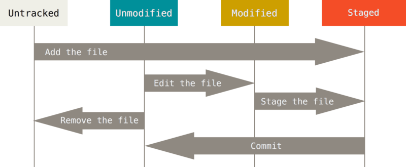

# 01 - Git Basics

In this introductory chapter we will review:
* [010 - Git Configuration](#010---git-configuration)
* [011 - Repository Creation](#011-repository-creation)
* [012 - Understanding the Staging Lifecycle](#012-understanding-the-staging-lifecycle)
* [013 - Git History](#013-git-history)
* [014 - File Operations](#014-file-management)

---

## 010 - Git Configuration

* Three Git configuration files on your system (from *lowest to highest priority*):
    - System's `/etc/gitconfig`
    - User space: `$HOME/.gitconfig` or `$HOME/.config/git/config`
    - Repository level: `.git/config` within your repository

* `git config` command let you *modify the files above through options*:
    - With `--system` option, reads/writes from `/etc/gitconfig`
    - With `--global` option, reads/writes from user space, aka `$HOME/.gitconfig`
    - With `--local` option, reads/writes from current repository, aka `.git/config`

* `git config --list` shows your current Git configuration.

### First-time Setup

**Step 1: Identify Yourself**

Git needs to know who is making the changes. Run these commands:

```bash
$ git config --global user.name "Your Name"
$ git config --global user.email "your-email@example.com"
```

**Step 2: Set the Default Editor**

We will use `nano` editor in the terminal (use `vim` only if you are familiar with it):

```bash
$ git config --global core.editor nano
```

**Step 3: Set the Default Branch**

* *Branching* is more advanced topic that we will cover in a dedicated section of this tutorial
* Curious fact: in 2020, GitHub moved default branch term from `master` to `main` 
    * Reasoning: https://sfconservancy.org/news/2020/jun/23/gitbranchname/
    * Versions lower to Git 3.0 still use `master` for default naming:
        ```bash
        hint: Using 'master' as the name for the initial branch. This default branch name
        hint: will change to "main" in Git 3.0. To configure the initial branch name
        hint: to use in all of your new repositories, which will suppress this warning,
        hint: call:
        hint:
        hint:   git config --global init.defaultBranch <name>
        hint:
        hint: Names commonly chosen instead of 'master' are 'main', 'trunk' and
        hint: 'development'. The just-created branch can be renamed via this command:
        hint:
        hint:   git branch -m <name>
        hint:
        hint: Disable this message with "git config set advice.defaultBranchName false"
        ```


Ensure that `main` is always being used as the default branch name:

```bash
$ git config --global init.defaultBranch main
```

---

## 011: Repository Creation

### Step 1: Initialize a New Repository: `git init`

In practical terms, a repository in Git is represented by a folder in your file system. Create a fresh folder (`mkdir` shell command) for the tutorial and initialize Git:

```bash
$ mkdir git-datascience-master-practice

# Be sure to 'cd' into the repository folder
$ cd git-datascience-master-practice
$ git init
```

**The importance of `git status` to understand each Git operation**

`git status` is an informative command that shall be used anytime we feel we need more information about what's happening within our Git Workflow:

```bash
$ git status
On branch main

No commits yet

nothing to commit (create/copy files and use "git add" to track)
```

Although still working with an empty repository, we gather important pieces of information:
- *Our current branch name*: this should be `main` if the Git Setup steps above (done through `git config`) have been followed.
- *Status of the files within the repository*: i.e. commits done or to-be-done, tracked/untracked files, ...
- *Hints on how to proceed*: next steps that are often done at the point where the current status is.

### Step 2: Create a File

```bash
# Note: we use the overwriting sign '>'
$ echo "# My Learning Journey" > README.md

$ git status
On branch main

No commits yet

Untracked files:
  (use "git add <file>..." to include in what will be committed)
        README.md

nothing added to commit but untracked files present (use "git add" to track)
```

**What the status information tells us:**
- `README.md` is untracked (under Untracked files)
- `README.md` was not in the previous snapshot (commit)
- *Hint*: `use "git add" to track`

### Step 3: Start Tracking the File: `git add`

`git add` marks the changes to the file to be added in the next commit. It does it by moving the change to the *Staging Area*:

```bash
$ git add README.md

$ git status
On branch main

No commits yet

Changes to be committed:
  (use "git rm --cached <file>..." to unstage)
        new file:   README.md
```

**What the status information tells us:**
- `README.md` is now staged (under *"Changes to be committed"*)
- *Hint*: the Git command to restore the `add` command (move the staged change back to untracked)

### Step 4: Commit the changes: `git commit`

Considerations about the `git commit` command:
- **Marks the registry of a new *version***, adding the changes that currently exist in the *Staging Area*.
    - Versions can be compared, reverted, etc.
- A **commit implies 1-or-more modifications to 1-or-more files**.
    - Modifications *shall be related, atomic and topical*
    > “A commit should contain related changes and nothing but related changes” (codefoster.com)
- The **commit message shall be descriptive in the long term**: critical to know its purpose at a glance.
    - The `git commit` command alone (without the `-m` option), opens up the default editor (we configured with `git config`)

```bash
# Shortcut to provide a commit message through `-m` option
$ git commit -m "Initial commit: add README"
[main (root-commit) bbbaa9f] Initial commit: add README
 1 file changed, 1 insertion(+)
 create mode 100644 README.md

$ git status
On branch main
nothing to commit, working tree clean
```

**What the commit information tells us:**
- The identifier of the commit (`bbbaa9f`) and the branch (`main`) where it has been done.
- Number of insertions (lines), how many files changed, and file permisions.

**What the status information tells us:**
- Our working directory is free of untracked or staged changes: `"nothing to commit"`

---

## 012: Understanding the Staging Lifecycle



**The Status of Files**
- Untracked: git does not know about these files
- Tracked: git knows about
    - Unmodified
    - Modified
    - Staged

**The Git Workflow**
1. Edit files &rarr; Modified
2. Stage the required files (`git add`) &rarr; Staged
3. Commit them (`git commit`) &rarr; Unmodified

### Claryfing sample of Git Staging Operation

1. Let's modify again the previous `README.md` file:

```bash
$ echo "Fix #1 added -- You can safely remove this line --" >> README.md

$ git status
On branch main
Changes not staged for commit:
  (use "git add <file>..." to update what will be committed)
  (use "git restore <file>..." to discard changes in working directory)
        modified:   README.md

no changes added to commit (use "git add" and/or "git commit -a")
```

**What the status information tells us:**
- `README.md` is *unstaged* (under *"Changes not staged for commit"*) &rarr; *modified* in the working directory but not *staged*.

2. Add the modification to the Staging Area with `git add`:

```bash
$ git add README.md

$ git status
On branch main
Changes to be committed:
  (use "git restore --staged <file>..." to unstage)
        modified:   README.md
```

**What the status information tells us:**
- `README.md` is staged and will go into the next commit

3. ..but before the commit, you've just realized that a last minute change is required..

```bash
$ echo "Fix #2: Very important fix added -- You can safely remove this line --" >> README.md

$ git status
On branch main
Changes to be committed:
  (use "git restore --staged <file>..." to unstage)
        modified:   README.md

Changes not staged for commit:
  (use "git add <file>..." to update what will be committed)
  (use "git restore <file>..." to discard changes in working directory)
        modified:   README.md
```

**What the status information tells us:**
- *`README.md` is staged and unstaged at the same time!?* &rarr; **Git works with insertions/lines added/removed in files, not with the files themselves**

**At this point..**:
- If you commit now, only the first change in `README.md` (“Fix #1..”) will go through.
- You need to `git add` + `git commit` again to stage the last modification.
```bash
$ git add README.md

$ git status
On branch main
Changes to be committed:
(use "git restore --staged <file>..." to unstage)
    modified:   README.md

$ git commit -m "fix: unnecessary messages added to the README.md file"
```

---

## 013: Git History

### More than a Backup
Git **doesn't just save copies; it records a semantic, searchable timeline** of your project's evolution.

To view the commit history of our project **we use `git log` command**:
```bash
$ git log
commit ef889ad4ca267c17c332bae571bc122f17a9a5e7 (HEAD -> main)
Author: Pablo Orviz <orviz@ifca.es>
Date:   Mon Oct 5 13:53:49 2026 +0200

    fix: unnecessary messages added to the README.md file

commit bbbaa9f0cecd722a7f2de87efd8a17845609f41c
Author: pablo <pablo@trea.ifca.es>
Date:   Mon Oct 5 13:00:08 2026 +0200

    Initial commit: add README
```

**What the Git history information tells us:**
- Ordered list of commit &rarr; Most recent commits show up first.
- Commit data:
    - Identifier of the commit.
    - Author’s name & email.
    - Date
    - Author’s commit message

### Advanced History Inspection with `git log`

Unlock the power of history inspection with the following flags:

- `git log --oneline`: Condenses every commit into a single, clean line.
- `git log --graph --all`: Draws an ASCII visual map of all your branches and merges directly in the terminal.
- `git log -n 1`: Shows only the last commits to avoid clutter.
- `git log --author="Pablo"`: Filters and displays commits matching the author name.
- `git log -1 --patch`: Shows modifications of last (`-1`) change. It uses `git diff` output.

### Unlocking the Power of Commit IDs (Hashes)

When you run `git log --oneline`, you will notice a 7-character code at the beginning of each line (e.g., `a1b2c3d`). This is the **Commit ID** (a short SHA-1 hash). Think of it as a *unique fingerprint* for that specific moment in time.

By capturing these IDs, you can perform surgical operations on your history using the CLI.

**1. Inspecting a Specific Commit: `git show`**
If you want to see exactly *what* changed inside a past commit (who wrote it, when, and the exact lines added or removed), use `git show` followed by the Commit ID:

```bash
git show <commit-id>
```

**2. Comparing Two Points in Time: `git diff`**
Instead of guessing what changed between last Tuesday and today, you can use the CLI to compare any two commits instantly.

* **Compare a past commit with your current working directory:**
  ```bash
  git diff <commit-id>
  ```
* **Compare two specific past commits against each other:**
  ```bash
  git diff <old-commit-id> <new-commit-id>
  ```

### Modifiable History

Git stands for the development of a *clean history*. To this end, it provides ways to **alter the commits already done at any point in time**.

**E.g. Fixing the Immediate Past with `git commit --amend`**
- The `--amend` flag allows us to modify the very last commit (first appearance in our history).
- Useful when: amending a typo, the commit message or any last-minute change not being added.

**Exercise**:
1. Modify the `README.md` file.
2. Track the change, adding it to the Staging Area.
3. Commit with the `--amend` flag to append this change as part of the last commit.

---

## 014: File Management

### 1. Moving or Renaming Files: `git mv`
If you want to rename a file or move it to a different folder, use `git mv` (Git Move). 

* **To rename a file:**
  ```bash
  git mv old-name.txt new-name.txt
  ```
* **To move a file into a folder:**
  ```bash
  mkdir src
  git mv new-name.txt src/
  ```

**Why is this better than associated Shell commands?** Run `git status` right after. You will see that Git instantly recognizes the action as a clean `renamed` event and automatically adds it to the **Staging Area**. No extra `git add` required!

### 2. Deleting Files Safely: `git rm`

The same applies for deleting files with Git: if you use the Git CLI, you won't need to stage this change with `git add`.

* **To delete a file from both your disk and Git tracking:**
  ```bash
  git rm src/new-name.txt
  ```

**Exercise**:
1. Create a temporary file: `echo "temp" > trash.txt`
2. Track it and save it: `git add trash.txt && git commit -m "Add temporary file"`
3. Now, delete it completely using the proper CLI command.
4. Run `git status` to confirm it is staged for deletion, then commit the change.