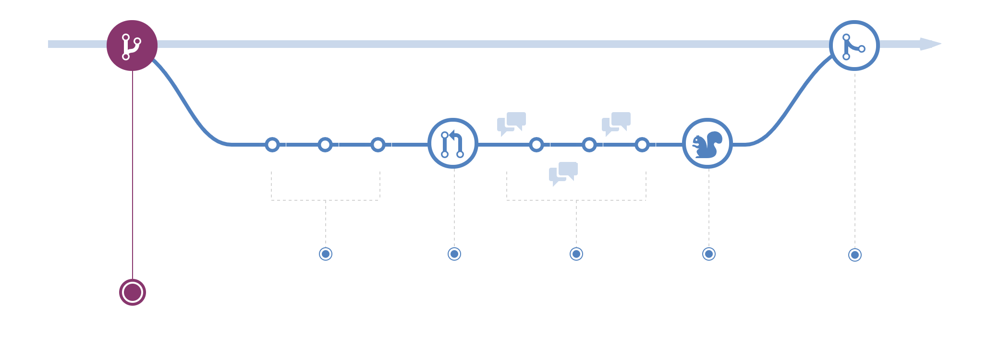

# 03 - Collaborative Work through Git+GitHub

In the previous lesson, we simulated *a teammate editing code directly on the `main` branch on GitHub*.
- **Not the recommended practice in the real world.**
- If everyone pushes directly to `main`, the production code will constantly break. To collaborate safely, teams use the **GitHub Flow**, which relies on two pillars: **Branches** (via Git CLI) and **Pull Requests** (via GitHub).

## The GitHub Flow



---

The GitHub flow is a **lightweight branch-based workflow** that supports teams and projects were deployments are made regularly, meant to simplify the development process and allows for simultaneously multi-branch development.

> “Diverge from the main line of development (main branch) and continue to do the work without messing with that main line” (Pro Git)

The **`main` branch** is not a special branch, only the one that (by convention) **shall maintain our fully-working version**. Accordingly, we will use additional branches to make changes (new features, bug fixes, etc.) in our repository.

**Step 1: Create a Feature Branch Locally**

The syntax to create a branch is either:

```bash
git branch <branch-name>
# this requires a succesive:
git checkout <branch-name>
```

or the shortcut:

```bash
git checkout -b <branch-name> # creates and switches to the branch at once
```

**Branches can start off from any given revision**. Both commands allow this by providing the *commit ID* or the *branch name*:

```bash
git checkout -b <branch-name> <source-branch-name-or-commit>
```

1. [Terminal] Create and switch to a new branch called `add-git-tips`:
     ```bash
     $ git checkout -b add-git-tips
     ```
2. [Terminal] Modify the `README.md` file in your editor (e.g. `nano README.md`) and add some tips at the bottom:
     ```markdown
     ## Pro Git Tips
     * Always write short, descriptive commit messages.
     * Use `git status` before every single command.
     ```
    - Tip for `nano`: `Ctrl+o` to save ; `Ctrl+x` to exit.
3. [Terminal] Save the file and commit your changes locally:
     ```bash
     $ git status
     $ git add README.md
     $ git commit -m "docs: add pro git tips section"
     ```

**Step 2: Publish Your Branch to GitHub**

1. [Terminal] To publish the branch in GitHub, use `git push`:
     ```bash
     $ git push origin add-git-tips
     ```

**Step 3: Open a Pull Request at GitHub**

As introduced when reviewing the GitHub platform, **a Pull Request (PR) is a GitHub feature, not Git's**. Thus, we switch now to the GitHub website:

1. [GitHub] Open your web browser and go to your **GitHub repository**.
2. [GitHub] Switch to the new feature branch `add-git-tips` (click on the button or use the branch list)
3. [GitHub] Click on *"Compare & pull request"*.
4. [GitHub] Write a brief description of what you did and click *"Create pull request"*.

The **PR has been created**, take your time to explore the interface.

**Step 4: Merge the Pull Request**

Once the code is approved, it is time to integrate it into production. 

1. [GitHub] On the GitHub PR page, scroll down and **click *"Merge pull request"* and then *"Confirm merge"***.
2. [GitHub] Clean up: **Click the *"Delete branch"***

*Under the hood, GitHub trigger a `git merge` for us!*

**Step 5: Bringing it All Back to the Terminal**

**Following the GitHub Flow, we have successfully and safely (*protecting `main` with a previous review*) merged the code into the GitHub repository**. Now sync the changes in your local machine:

1. [Terminal] Switch back to your local `main` branch:
   ```bash
   git checkout main
   ```
2. [Terminal] Download the newly merged code from GitHub:
   ```bash
   git pull origin main
   ```
3. [Terminal] Delete your local temporary branch to keep your workspace clean:
   ```bash
   git branch -d add-git-tips
   ```

Now you can run `git log` and analyse the output.

---

## Solving a Merge Conflict

A *Merge Conflict* happens when **Git gets confused because the same line of the same file has been modified in two different ways**, and it doesn't know which version is the correct one &rarr; Thus common in collaborative environments.

Let's simulate this scenario by creating a clash between two branches modifying the same line/s:

**Step 1: Modifying the code locally**

First, let's create a change on your machine while staying on the `main` branch (NOT A GOOD PRACTICE: just for the purpose of this tutorial!).

1. Open `README.md` in your editor, go to the **very first line and change it** to:
   ```markdown
   # Git Workshop: Mastering the Command Line Interface (CLI)
   ```
2. **Save the file and commit** the change using the terminal:
   ```bash
   git add README.md
   git commit -m "docs: improve title to highlight CLI"
   ```
3. *Do NOT push this commit yet! Keep it local.*

**Step 2: The "Teammate" modifies the SAME line on GitHub**

1. In your **GitHub repository**, open the `README.md` file and **click the *"pencil icon"* to edit** it.
3. **Change the very first line** to this instead:
   ```markdown
   # Git & GitHub Collaboration Course
   ```
4. Scroll down, add a commit message like `"Update main title from web"`, and click *"Commit changes"*.

**Step 3: The Merge Conflict pops up**

Your local machine has one title version, and GitHub has another. Let's try to pull the remote changes to sync your project:

```bash
git pull origin main
```

&rarr; *Boom!* 🛑 Look closely at your terminal output. You will see an error message resembling this:
```text
CONFLICT (content): Merge conflict in README.md
Automatic merge failed; fix conflicts and then commit the result.
```

**Step 4: Solving the Merge Conflict**

&rarr; *Don't panic*. Git has injected **Conflict Markers** directly into your `README.md` file to show you both versions. Open `README.md` in your editor and you will see a similar  structure to the one below:

```text
<<<<<<< HEAD
# Git Workshop: Mastering the Command Line Interface (CLI)
=======
# Ultimate Git & GitHub Collaboration Course
>>>>>>> 29a8b1c... Update main title from web
```

&rarr; *Understanding the Markers:*
> * `<<<<<<< HEAD`: This marks the start of **your local changes** (what you committed on your machine).
> * `=======`: The divider line. Everything above is yours; everything below is incoming.
> * `>>>>>>> [commit-id]`: This marks the end of the **incoming changes** from GitHub.

&rarr; *The Fix*: **delete the marker lines and manually edit the text as you would like to appear. Save the file.**

**Step 5: Finalizing the Merge**
Once the file is cleaned up and saved, you need to **tell Git that the conflict is officially resolved** (`git status` provides the hints):

1. **Stage the resolution:**
   ```bash
   git add README.md
   ```
2. **Commit the merge:** (Since Git already knows this is a merge, you can just run `git commit` or add a message).
   ```bash
   git commit -m "merge: resolve title conflict between local and remote"
   ```
3. **Send the clean history back to GitHub:**
   ```bash
   git push origin main
   ```

Check what `git log` says.